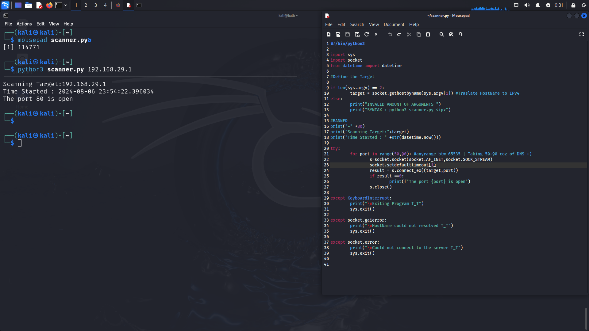

# Simple Python Port Scanner


A lightweight and easy-to-use port scanner written in Python, designed for Linux systems. This script allows you to scan a range of ports on a target IP address to identify open ports, making it a handy tool for network diagnostics and educational purposes.

## Features

- **Scan a Range of Ports**: Check ports in a specific range (default: 50-90).
- **Handle Common Errors**: Gracefully handle errors like hostname resolution issues and connection problems.
- **Simple Usage**: Minimal setup required; run with command-line arguments.

## Requirements

- Python 3.x
- Linux-based operating system
  
## Screenshot



## Installation

1. **Clone the Repository**:
   ```bash
   git clone https://github.com/RiteshKumarNayak/CrappyPortscanner.git

2. **Follow the Prompts:**:
   ```bash
   Enter the target IP address.
   Enter the starting port number.
   Enter the ending port number.
   
## Contributing

Feel free to open issues or submit pull requests to improve this tool. Contributions are welcome!

## License

This project is licensed under the MIT License - see the [LICENSE](LICENSE) file for details.

## Acknowledgments

- Inspired by various network programming tutorials and educational resources.

## Contact

For questions or feedback, please contact [ritesh4u2020@gmail.com].


